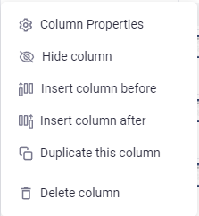
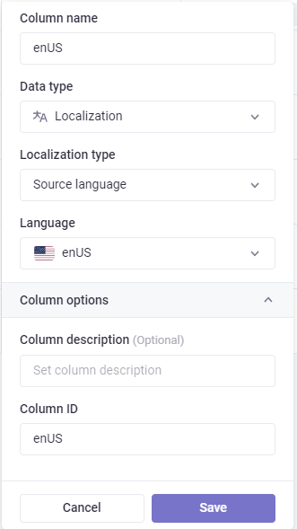
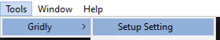
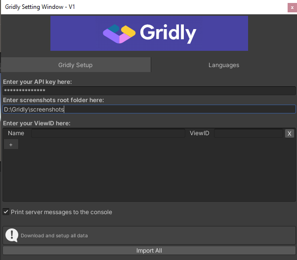
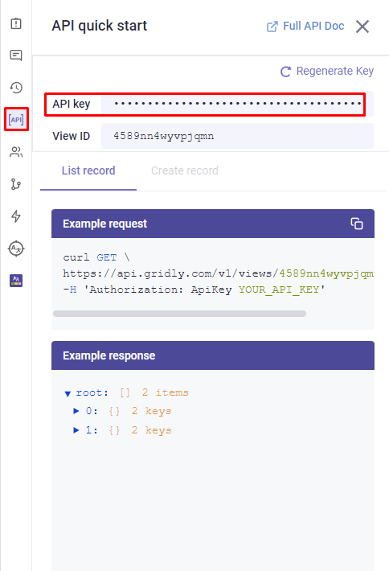
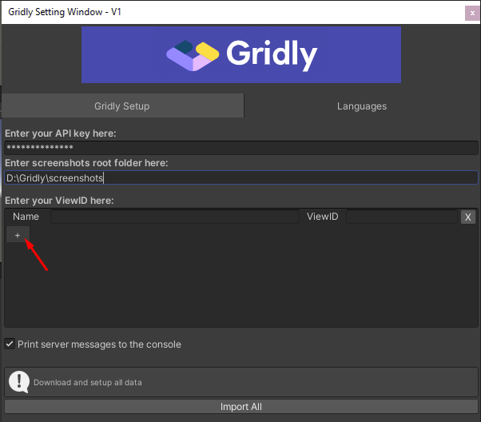
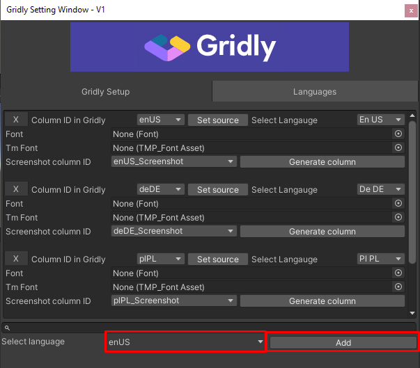
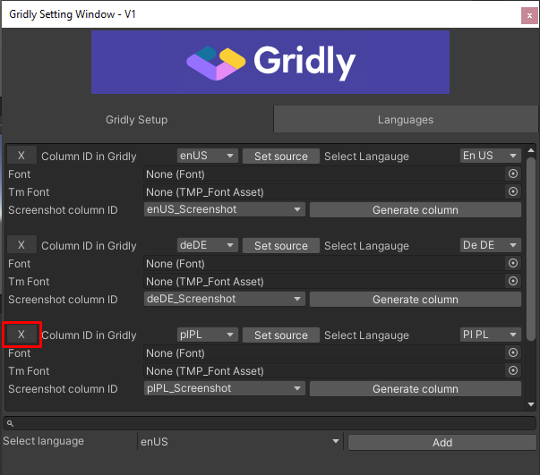
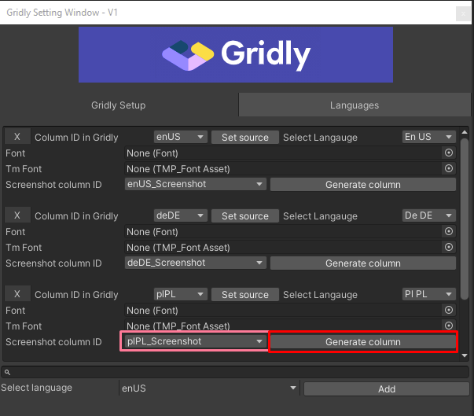

# GRIDLY PLUGIN
### 1. What this plugin can do
This Plugin can help you sync data between Unity and Gridly.   
By using the path you can get the string data based on the
target language.

### 2. Setup first columns in Gridly
To be able to use this plugin with Gridly, there is some
initial setup you will have to do within Gridly so that the
plugin can refer to the correct columns in Gridly. First you
need to specify a **columnID**. This you have to do for each of
the columns containing language texts. To do this you simply
open the grid in Gridly that you want to use with the
plugin. Then for each of the language columns you select the
option **Column properties**.  

    

  

Then you can change the columnID to the specific four
character language code that applies to the text in the column,
make sure that the capitalization is correct with the two
country letters in capital:  

    

  

### 3.1 Connect Unity to Gridly
First you need to open the Gridly setting window by going to:
**Tools**->**Gridly**->**Setup Setting**  

    

  
Here you have to enter your API key and define the folder where you store or you will store the screenshots that generated about your game.  

    

  
You can find your API key in Gridly at the following place on the right pane:
  

    

  
By default the plugin adds two views, but those are dummies, so feel free to delete or change their name and viewID.  
You can add new view by clicking on the plus icon  

    

  

### 3.2 Maintain languages in the plugin
* You can add a language by select a language from the list and click on "Add" button, by adding a language to your project, it creates the column for this language in Gridly  

    

  

* You can remove the language by clicking on its "X" button. On deleting a language, you will get two dialog. The first will ask you to remove the language from Unity, and the second will ask you about to delete the language column and the screenshot column of this language.  

    

   

* You can select that what type of font you would like to use on showing the strings in your game by setting the "Font" or the "TmFont" which is stands for the Text Mesh Pro.
* You can select the column what you would like to use in Gridly for storing the images from the given language by clik on the dropdown menu next to the "Screenshot column ID", or if you don't have any, you can create on by clicking on the "Generate column", this button creates a "files" type column in Gridly, then you can select this column ID from the list.  

    

    

* You can change your project source language by clicking on the "Set source" button.
* You can change the column ID of the language by clicking on the dorpdown list next to the "Column ID in gridly"
* You can change the language code of the given language by clickin on the last dropdown list in the first horizontal line of the language