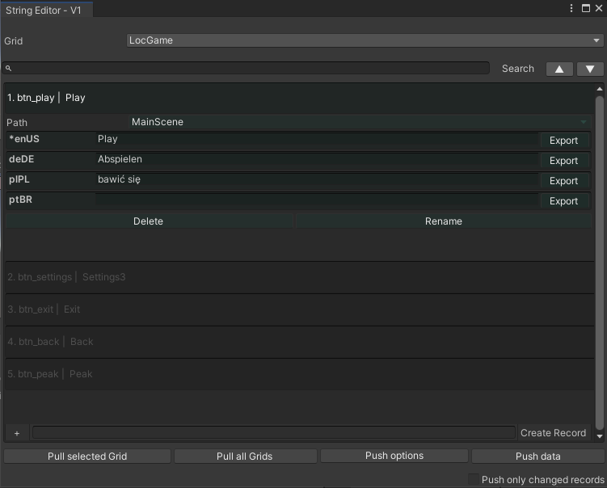
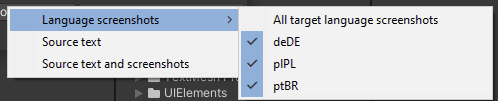
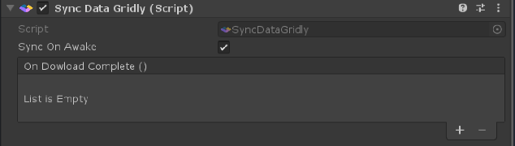
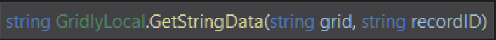
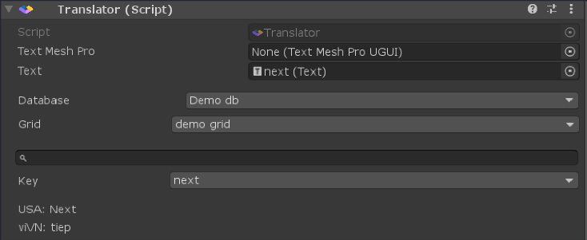
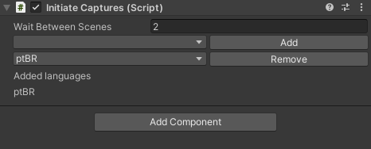
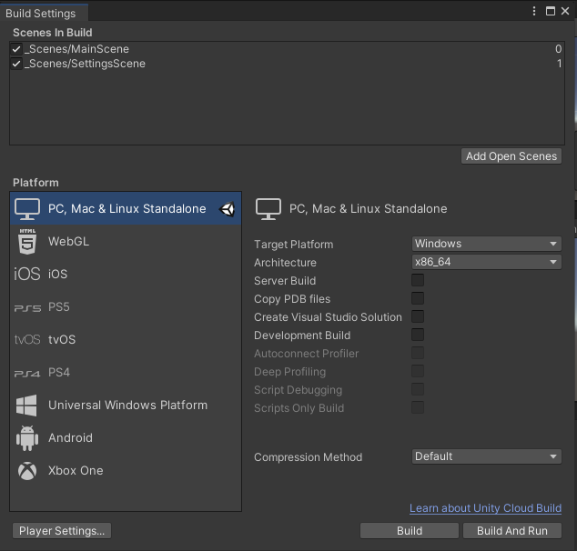
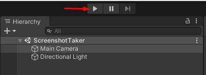

# GRIDLY PLUGIN
### 1. What does this plugin do?
This Plugin can help you sync data between Unity and Gridly.   
By using the path you can get the string data based on the
target language.

### 2. Setup first columns in Gridly
To be able to use this plugin with Gridly, there is some
initial setup you will have to do within Gridly so that the
plugin can refer to the correct columns. First you
need to specify a **columnID**. This you have to do for the source language column. To do this open the grid in Gridly that you want to use with the
plugin and for the source language column select the
option **Column properties**.  

Change the columnID to the specific four
character language code that applies to the text in the column,
make sure that the capitalization is correct with the two
country letters in capital:  

### 3. Connect Unity to Gridly
### 3.1 Setup in Unity
First you need to open the Gridly setting window by going to:
**Tools**->**Gridly**->**Setup Setting**  

Here you have to enter your API key and define the folder to store the screenshots that generated.  

You can find your API key in Gridly at the API quick start in the right pane:

By default the plugin adds two views, but those are dummies, so feel free to delete or change their name and viewID.  
You can add new view by clicking on the plus icon

### 3.2 Maintain languages in the plugin
* You can add a language by selecting a language from the list and clicking on the "Add" button. Adding a language to your project, creates the column for this language in Gridly

* You can remove the language by clicking on its "X" button. On deleting a language, you will get two dialogs. The first will ask you to remove the language from Unity, and the second will ask you about deleting the language column and the screenshot column of this language in Gridly.

* You can select what type of font you would like to use by setting the "Font" or the "TmFont" which is stands for the Text Mesh Pro.
* You can select the column to use in Gridly for storing the images from the given language by clicking on dropdown menu next to the "Screenshot column ID". If you don't have any, you can create one by clicking on the "Generate column" button, which creates a "files" type column in Gridly. Then select this column ID from the list. 

  

* You can change your project source language by clicking on the "Set source" button.
* You can change the column ID of the language by clicking on the dropdown list next to the label "Column ID in Gridly"
* You can change the language code of the given language by clicking on the "Select language" dropdown list.

### 4. String editing
### 4.1 String editor window
Select **Tool**->**Gridly**->**String Editor** to open the string editor window

  
**Path** : You can select the scene where the string is. This needs to be set, if you want to upload screenshots for that scene  
**Delete** : Delete the record in Gridly and Unity  
**Rename** : Rename the key in Gridly and Unity  
**Create Record** : In its textbox you must specify the string ID, then hit  "Create Record" button to add it to the list  
**Pull selected grid** : Download all data of the selected Grid  
**Pull all grids** : Download all data of all Grids you saved in the settings  
**Push options** : You can select what data you would like to upload on pushing the data into Gridly  

    

> **Source text** : Push only the source strings into Gridly  
**Source text and screenshots**: Push source text and its screenshots into Gridly  
**Language screenshots** : If you select any languages, it will upload the screenshot into the column selected for that language

**Push only changed records** : Selecting this checkbox will only push the strings that have been changed locally in Unity

### 4.2 Sync data at runtime
This feature makes it possible to get data from Gridly without having to  rebuild the game
You can use this component to get data.  

    
**Note** : Retrieving data from Gridly is only for project development. This feature **cannot** be used for public objects.

### 4.3 Translate text
+ Use the following **void** to set your target language  

  

+ Use the following **void** to get your text  

    

+ Use this component to translate UI text  

    

### 5. Example screenshot generator
### 5.1 Setup script
The ScreenshotTaker scene inside Gridly/ScreenshotSceneUtility has a script where you can define the languages you want to use during the screenshot creation and the number of seconds to wait between scene change.  

    

> You can add a language by selecting a language from the dropdown list and clicking on the "Add" button. You can remove a language by selecting it and clicking on "Remove". The added languages can be found in the "Added languages" list.

During the screenshot generation all the scenes added to the "Scenes in Build" list will be used. You can add your scenes by going to **File**->**Build settings**  

    

The screenshots will be saved to the path defined in the Gridly setup menu. The script creates subfolders for each language.
You can start the screenshot generation process by start the scene with the play button.  

    
